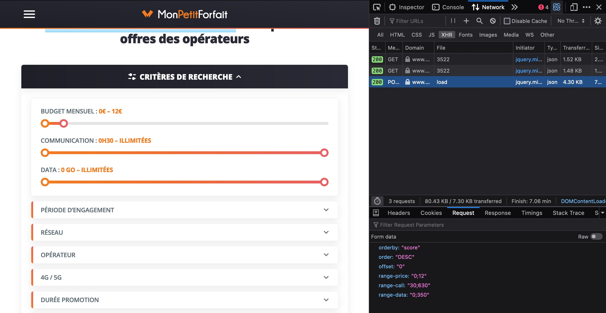

## Comment régler ses critères de recherche

1. Visitez [MonPetitForfait](https://www.monpetitforfait.com/comparatif-forfaits-pas-chers)
2. Ouvrez les outils de développement et basculez sur l'onglet 'Réseau'.
3. Affinez vos critères de recherche sur le site.
4. Filtrez les requêtes pour ne garder que les XHR et sélectionnez la dernière requête POST load.
5. Copier les données de la requête (voir capture d'écran) et remplacer le contenu de l'[objet param des ligne 9-16](./handler.js#L9:L16).

