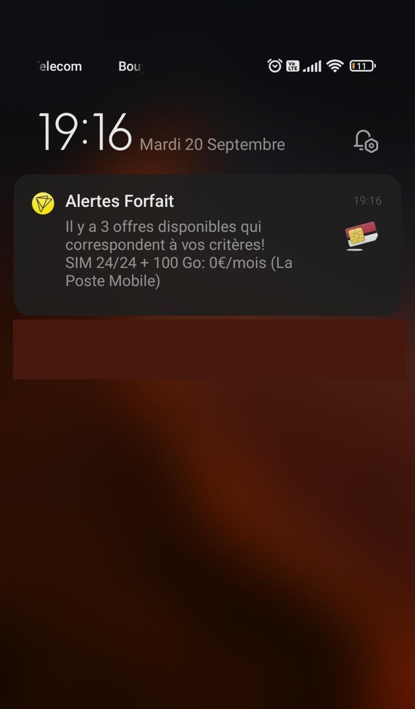

# Alertes Forfait

Alertes Forfait est un script qui trouver automatiquement les meilleures offres de forfait mobile disponibles en France selon des critères choisis. Le script a conçu pour être déployé sous forme de fonction sur AWS Lambda et s'éxecute automatiquement tous les 3 jours par défaut (modifiable dans `serverless.yml`).

<p align="center">

</p>

## Utilisation

1. Installer les dépendances:
```
npm install -g serverless
```

```
npm install
```

2. Créer un compte Pushed.co et suivre [les instructions](https://pushed.co/quick-start-guide) pour setup les notifications poussés.
3. Créer un fichier `.env` en suivant le modèle `.env.example` et mettez-y vos informations Pushed.co.
4. Changer les critères de recherche souhaités en suivant ce [TUTO](./HOW-TO.md).

### Déployer la fonction lambda sur AWS
Nécessite un compte AWS et de [créer un utilisateur sur IAM](https://www.youtube.com/watch?v=KngM5bfpttA)

```
# Pour Windows, remplacez 'export' par 'set'
export AWS_ACCESS_KEY_ID=<your-key-here>
export AWS_SECRET_ACCESS_KEY=<your-secret-key-here>
serverless deploy
```

### Executer la fonction lambda en local

```
serverless invoke local --function checkOffers
```

## Contributions

J'ai développé ce script assez rapidement pour mon usage personnel. Il y a donc sûrement beaucoup d'améliorations et d'options supplémentaire possibles alors j'encourage toute contribution ou report de bug.

